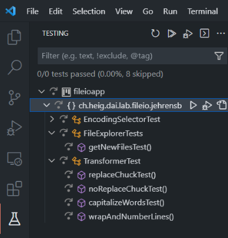
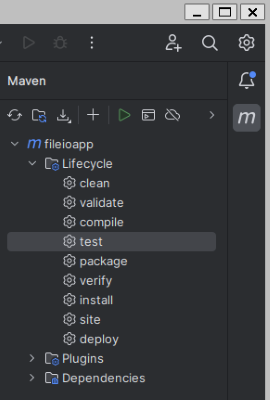
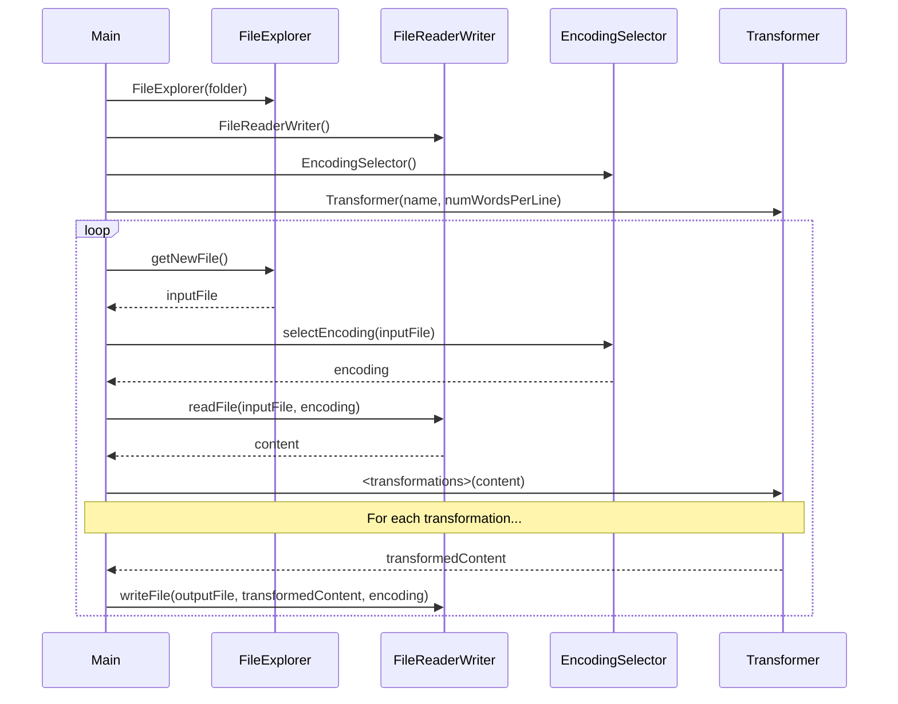

DAI Lab 2: File I/O
===================


Goals
------------------------------------------------------------------------------

The goals of this lab are:
- Java
  - Manipulate `String` objects (split, join, replace, StringBuilder, etc.).
  - Use the `java.io` API (`InputStream`, `OutputStream`, `BufferedReader`, `BufferedWriter`, etc.) to read and write data.
  - Read and write textual data using the appropriate character encoding.
  - Use the try-with-resources statement to properly close streams.
- Tools
  - Know how to add JUnit to a Maven project.
  - Run unit tests from the command line with Maven.
  - Run unit tests from an IDE.
  - Use the debugger of your IDE to debug your code.
- Git
  - Use the fork / pull request workflow.
  - Create and work in new branches.
  - Pull changes from a remote repository.


Introduction
------------------------------------------------------------------------------

In this lab you will create write a Java program that reads a text files and
performes some simple transformations on it. 

You will also use Git to manage your code and submit your work.


Preparation
------------------------------------------------------------------------------

### Fork the repository

You cannot directly commit to this repository. You must therefore first create your own copy of the repository.

To do this, click on the "Fork" button in the top right corner of this page on GitHub. This will create a copy of the repository in your own GitHub account.

Now there are two repositories: 
* **upstream**: the original repository on the DAI organization. You cannot commit to this repository.
* **origin**: your own copy of the repository. You can commit to this repository.

Then clone your forked repository (*origin*) to your computer.

### Explore the code

    dai-lab-fileio
    ├── fileioapp
    │   ├── pom.xml
    │   └── src
    │       ├── main/java/ch/heig/dai/lab/fileio/
    │       │   ├── Main.java
    │       │   ├── jehrensb
    │       │   │   ├── EncodingSelector.java
    │       │   │   ├── FileExplorer.java
    │       │   │   ├── FileReaderWriter.java
    │       │   │   └── Transformer.java
    │       └── test/java/ch/heig/dai/lab/fileio/
    │           └── jehrensb
    │               ├── EncodingSelectorTest.java
    │               ├── FileExplorerTests.java
    │               └── TransformerTest.java
    └── README.md

The repository contains a Maven project `fileioapp`. We can see that it's a Maven project because of the `pom.xml` file.

Following the standard Maven directory layout, the project contains a `src` directory with two subdirectories: `main/java` and `test/java`:
* `main/java` for the source code of the project.
* `test/java` for the unit tests of the project.

The `main` directory contains the package `ch.heig.dai.lab.fileio` with the class `Main`. This is the main class of the project.
Inside this package there is a subpackage `ch.heig.dai.labo.fileio.jehrensb` with classes `EncodingSelector`, `FileExplorer`, `FileReaderWriter` and `Transformer`.

The `test` directory mirrors this structure. It contains unit test for some of the classes in the `ch.heig.dai.labo.fileio.jehrensb` package.

### Unit testing with Maven

The Maven `pom.xml` file is configured to run the unit tests when you build the project. If you open the file, you will see:
* The `maven-surefire-plugin` plugin: this is a plugin that runs the unit tests under the `test` directory when you build the application.
* The dependencies `org.junit` and `org.junit.jupiter`: these are the JUnit libraries that are used to write and run unit tests.

Maven automatically downloads these dependencies when you build the project for the first time.

Let's try this! Open a terminal, go into the fileioapp directory and run the following command:

```bash
mvn clean test
```

Maven should print "BUILD SUCCESS" as well as warnings in yellow that some tests have been skipped.

### Unit testing with your IDE

You can also run the unit tests from your IDE.

Open the directory `./fileioapp` in your IDE (*not* the root directory of the repository). Because of the `pom.xml`file your IDE should recognize the project as a Maven project and import it.

 

Try running the unit tests from your IDE.

Git fork / pull request workflow
------------------------------------------------------------------------------

> [!IMPORTANT]
> Before starting to write your program, you must read the document on the Git fork / pull request workflow on Cyberlearn. 

This is the workflow you will use to submit your work.

The fork / pull request workflow sounds long an complicated, but it is actually quite simple. 

Let's try it. The task will be to create a new folder for you in the source code and test code of the project.

1. Go to the *original repository* on GitHub and create an issue for the task you want to work on: "*Create folders for <your_usename_on_github>*.
1. Got to *your fork* repository on GitHub and click on the "Sync fork" button. This will synchronize your repository with the original repository and import all recent changes.
1. In your terminal, switch to the main branch of your repository. Then create a feature branch "feature-create-folders" and switch to it:
    ```bash
    git switch main
    git branch feature-create-folders
    git switch feature-create-folders
    ```
  
2. Create the new folders for you:
   - In the source code folder `./fileioapp/src/main/java/ch/heig/dai/lab/fileio/` copy the folder `jehrensb` to `<your_usename_on_github>`.
   - In the test folder `./fileioapp/src/test/java/ch/heig/dai/lab/fileio/` copy the folder `jehrensb` to `<your_usename_on_github>`.
   - In the different files that you copied, you will have to update the package names to `ch.heig.dai.lab.fileio.<your_usename_on_github>`.
3. Run the unit tests to make sure that everything is still working.
   The tests for the new folders should show up in the IDE and be executed without an error.
4. Add, commit and push your changes to your repository:
    ```bash
    git add .
    git commit -m "Create folders for <your_usename_on_github>"
    git push
    ```
   Git will ask you to create a new branch on your remote repository. Use the command it suggests.
5. Go to the GitHub page of your fork and create a pull request. The pull request will be visible in the original repository. In the comment of the pull request, include the text "**Closes #<id_of_the_issue>**". This will automatically close the issue that you've created on the original repository. 
6. Go see the instructor to have your pull request reviewed.
7. When the pull request is accepted, go to GitHub and sync your fork.
8. In a terminal, switch to the main branch of your repository and pull the changes from your repository.
    ```bash
    git switch main
    git pull
    ``` 
  The changes you made in your feature branch should now be in the main branch, visible for everybody.

You can now start a new iteration at step 1 for the next tasks.


Development
------------------------------------------------------------------------------

We are now ready to start the actual development of the program.

The program reads input files (Chuck Norris jokes) from a folder, transforms the text and writes it to an output file.

The diagram below shows how the final program should work.



The program has 5 components:

**FileExplorer**

The FileExplorer lists the files in a folder and keeps track of the files that have already been returned. Each time the method `getNewFile` is called, it reads the folder and returns a file that has not been returned before.

Use the `java.io.file` API to get the list of files in the folder. Use the `HashSet` `knownFiles` to keep track of the files that have already been returned.

**EncodingSelector**

The method `getEncoding` returns the `Charset` to be used to read an input file. It does this by looking at the extension of the file name.

**FileReaderWriter**

It has two methods. The method `readFile(file, encoding)` reads the content of a file and returns it as a `String`. The method `writeFile(file, content, encoding)` writes the content to a file, using the given encoding.

Use the `...Stream` and `...Reader` classes from the `java.io` API to read and write the files.

**Transformer**

The `Transformer` class provides three methods to transform strings:
* `replaceChuck`: replaces the words "Chuck Norris" by another name (provided to the constructor).
* `captializeWords`: capitalizes the first letter of each word.
* `wrapAndNumberLines`: wraps the text to a given number of words per line and add a number at the beginning of each line.


Develop the component classes
------------------------------------------------------------------------------

Proceed in the followin order:
1. `FileExplorer`
1. `EncodingSelector`
1. `FileReaderWriter`
1. `Transformer`

For each component, follow the pull request workflow:
1. Sync your fork with the original repository.
1. Switch to the main branch and pull the changes from your repository.
1. Create an issue on the original repository
1. Create a feature branch and switch to it
1. Remove the `@Disabled` annotation from the unit tests of the component. Adapt the import in the unit tests to the your package name.
1. Implement the component and test it with the unit tests.
1. When you are finished, add, commit and push your changes to your repository.
1. Create a pull request and have it reviewed by the instructor.

### USE THE DEBUGGER!

 Sorry for the blinking warning sign, but this is important!

**Never ever** add `System.out.println(...)` statements to debug your code. Learn to use the debugger of your IDE instead. It will save you a lot of time and headaches.

When a unit test fails, set a breakpoint in the unit test or the tested code and run the test in debug mode. Then step through the code to see what is happening. You will find the error much faster than with `System.out.println(...)`.

Debugging will probably be one of the **most important skills** for your professional life. So start practicing now!


Develop the main class
------------------------------------------------------------------------------

Once the components are finished and the unit tests are passing, you can develop the main class.

The main class takes a folder name as command line argument. The folder contains the files to transform. To create this folder, unzip the file `jokes.zip` file anywhere on your computer, but not in the repository folder.

Then follow the pull request workflow again, i.e. create a feature branch before starting to work on the main class.

To test the main class, compile it with maven and run it with `java -jar target/fileioapp-1.0.jar <folder_name> <words_per_line>`.

When you are finished, add, commit and push your changes to your repository.


Submission
------------------------------------------------------------------------------

When you are finished, create a pull request for the last task. Your grade will be based on all your pull requests.
